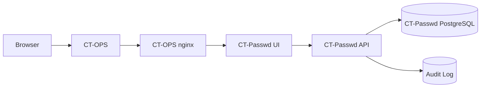

# CT-Passwd Implementation Plan

This is the coordination file for agents building CT-Passwd and the CT-OPS
integration around it.

CT-Passwd code belongs in the private repository
`git@github.com:simonjcarr/ct-passwd.git`. CT-OPS integration work belongs in
this repository. Agents must keep this file current so parallel or overnight
sessions do not duplicate work.

## Agent Operating Rules

Before starting:

- Read `AGENTS.md` in the CT-OPS repository root and follow it exactly.
- Read this file from top to bottom.
- Pick the first task with status `Not started` whose dependencies are
  complete.
- Change that task to `In progress` with your agent/session name and timestamp
  before editing code.
- Use a dedicated Git worktree before making file changes.
- Use test-first development for new behaviour unless the task is explicitly
  docs-only.
- Do not work on a task already marked `In progress`.
- Do not skip validation.
- Commit with a Conventional Commit message.
- Push the branch and open a pull request.
- Update this file at the end with status, PR link, validation run, what
  changed, and what remains.
- If you identify an unrelated security issue, follow `AGENTS.md`: create a
  focused GitHub issue rather than expanding your task scope silently.

Status values:

- `Not started`
- `In progress`
- `Blocked`
- `Complete`

## Architecture Decisions

- CT-Passwd is a separate product repository:
  `git@github.com:simonjcarr/ct-passwd.git`.
- CT-Passwd is installed as Docker containers in customer air-gapped networks.
- CT-OPS is the only product entry point, identity provider, licence gate, and
  nginx reverse-proxy owner.
- CT-Passwd is invisible in CT-OPS unless a valid CT-Passwd licence exists. No
  nav item, route, settings card, search result, teaser, or hint should be
  visible without an entitlement.
- CT-Passwd owns all password-manager forms and workflows. CT-OPS must not
  render CT-Passwd forms from JSON.
- Default routing is a dedicated hostname through the CT-OPS nginx reverse
  proxy, for example `https://passwd.customer.local`.
- Path routing, for example `https://ct-ops.customer.local/passwd`, is a
  documented fallback only for customers that cannot create a second hostname.
- CT-Passwd authenticates users only through CT-OPS-issued signed launch
  assertions.
- CT-Passwd must not query the CT-OPS database directly.
- MVP has no admin recovery for lost CT-Passwd unlock passwords.
- Future recovery must be opt-in, dual-control, heavily audited, and explicitly
  documented as weakening the zero-knowledge posture.

## Security Model

CT-Passwd uses browser-side zero-knowledge encryption for password entries.
The server stores encrypted blobs, authorization metadata, and audit metadata;
it must not receive plaintext secrets.

Secret fields encrypted in the browser:

- username
- password
- URL
- notes
- TOTP seed
- custom fields
- attachment metadata
- any other sensitive metadata

Plaintext allowed:

- entry title, with a UI warning not to include sensitive data
- vault name
- audit action type
- object ids
- timestamps
- non-secret operational metadata

Crypto requirements:

- Use Argon2id for unlock-password key derivation.
- Use authenticated encryption: AES-256-GCM or XChaCha20-Poly1305.
- Use unique nonces per encryption operation.
- Generate random per-entry or per-entry-version data encryption keys.
- Give each vault a vault key.
- Wrap each vault key separately for every authorized user.
- Never send unlock passwords, derived keys, private keys, vault keys, entry
  DEKs, or plaintext secret values to the server.
- Never log secret values.
- Do not invent custom cryptography.
- Follow OWASP and NIST guidance for password storage, cryptographic storage,
  API security, rate limiting, and secure error handling.

Shared vault model:

- Each user has a browser-generated public/private encryption key pair.
- The user's private key is encrypted locally using a key derived from their
  CT-Passwd unlock password.
- Each vault has a vault key.
- The vault key is wrapped separately for every authorized user.
- Entry DEKs are wrapped by the vault key.
- Adding a user requires an authorized unlocked user to wrap the vault key for
  the new user's public key.
- Removing a user requires rotating the vault key for future access. Past
  access cannot be cryptographically clawed back after a user has viewed or
  copied a secret.

Required audit events:

- create
- update
- delete
- view
- copy
- export
- failed unlock
- successful unlock
- permission changes
- admin actions
- key rotation
- backup and restore actions

Audit logs must never contain secret values.

## High-Level Architecture



Expected air-gapped deployment shape:

```text
ct-ops-web
ct-ops-ingest
ct-ops-db
ct-ops-nginx
ct-passwd-api
ct-passwd-web
ct-passwd-db
```

Splitting CT-Passwd worker jobs from the API can come later if scale or
operational reliability requires it.

## API Boundaries

CT-OPS to CT-Passwd:

- plugin instance registration
- signed launch assertions
- subscription or entitlement status
- service-to-service health and configuration status
- nginx install/config status

Browser to CT-Passwd:

- launch assertion exchange
- plugin-local CT-Passwd session
- unlock setup
- encrypted user key material fetch
- encrypted vault and entry CRUD
- audit-triggering view, copy, and export requests

CT-Passwd to CT-OPS:

- optional subscription-status check
- optional health or connection state
- no direct database access

Service authentication should align with the existing CT-CVE contract: signed
service tokens or mTLS-backed client assertions with timestamp, nonce, body hash,
scope, organisation binding, and replay protection. Static bearer tokens alone
are not acceptable.

## Implementation Tasks

| ID | Task | Repo | Dependencies | Status | Owner | PR | Notes |
| --- | --- | --- | --- | --- | --- | --- | --- |
| 1 | Create CT-Passwd product architecture docs in CT-OPS | ct-ops | none | In progress | Codex 2026-05-03 21:34 BST |  | Adding internal and published CT-Passwd architecture docs for boundary, routing, zero-knowledge, and threat model. |
| 2 | Add CT-Passwd implementation plan file | ct-ops | none | Complete | Codex 2026-05-03 20:53 BST | https://github.com/carrtech-dev/ct-ops/pull/866 | Created this coordination file and seeded the initial handoff log. |
| 3 | Add shared plugin identity broker design/update | ct-ops | none | Not started |  |  | Align with existing CT-CVE plugin identity direction. |
| 4 | Add plugin entitlement storage design for CT-Passwd | ct-ops | 3 | Not started |  |  | CT-Passwd hidden unless licensed. |
| 5 | Add CT-Passwd nginx reverse-proxy install design | ct-ops | 4 | Not started |  |  | Dedicated hostname default, path fallback documented. |
| 6 | Bootstrap `simonjcarr/ct-passwd` repository | ct-passwd | 1 | Not started |  |  | Monorepo with API, UI, crypto, db, deploy packages. |
| 7 | Add CT-Passwd CI, lint, type-check, test, and release skeleton | ct-passwd | 6 | Not started |  |  | Include release-please/container publishing path. |
| 8 | Add Docker Compose and air-gap deployment skeleton | ct-passwd | 6 | Not started |  |  | API/UI/Postgres initially; split worker later if needed. |
| 9 | Add database schema and migrations | ct-passwd | 6 | Not started |  |  | Users, vaults, memberships, entries, key wraps, audit, nonces, sessions. |
| 10 | Add crypto package tests first | ct-passwd | 6 | Not started |  |  | Argon2id, AEAD, key wrapping, nonce uniqueness, tamper rejection. |
| 11 | Implement browser-side crypto package | ct-passwd | 10 | Not started |  |  | Must be usable by UI without server plaintext access. |
| 12 | Implement CT-OPS launch assertion verification | ct-passwd | 9 | Not started |  |  | Verify issuer, audience, product, org, user, expiry, jti. |
| 13 | Implement CT-Passwd local session and secure cookies | ct-passwd | 12 | Not started |  |  | Short-lived plugin-local session after launch assertion. |
| 14 | Implement unlock setup and encrypted user private key storage | ct-passwd | 11,13 | Not started |  |  | Server stores encrypted private key only. |
| 15 | Implement vault CRUD and membership authorization | ct-passwd | 9,13 | Not started |  |  | Backend enforces object permissions; no plaintext secrets. |
| 16 | Implement shared vault key wrapping | ct-passwd | 11,15 | Not started |  |  | Add/remove users, rotate vault key on removal. |
| 17 | Implement encrypted entry CRUD | ct-passwd | 11,15 | Not started |  |  | Browser encrypts; API validates shape and authorization only. |
| 18 | Implement explicit reveal/copy/export audit flows | ct-passwd | 17 | Not started |  |  | Audit event without secret values. |
| 19 | Build CT-Passwd hosted UI shell | ct-passwd | 13 | Not started |  |  | Match CT-OPS design conventions; no JSON-rendered forms. |
| 20 | Build unlock UI and lock/session timeout UX | ct-passwd | 14,19 | Not started |  |  | Private keys only in browser memory after unlock. |
| 21 | Build vault and entry management UI | ct-passwd | 17,19,20 | Not started |  |  | Include title sensitivity warning. |
| 22 | Build sharing and permission UI | ct-passwd | 16,21 | Not started |  |  | Viewer/editor/admin/owner roles. |
| 23 | Add audit log UI/API | ct-passwd | 18 | Not started |  |  | Create/update/delete/view/copy/export/failed unlock/permission/admin events. |
| 24 | Add rate limiting, replay protection, secure headers, and CSRF/CORS policy | ct-passwd | 13 | Not started |  |  | Follow CT-OPS security expectations. |
| 25 | Add CT-OPS CT-Passwd hidden licence gate | ct-ops | 4 | Not started |  |  | No visible hint unless licensed. |
| 26 | Add CT-OPS CT-Passwd launch route/action | ct-ops | 3,25 | Not started |  |  | Issues short-lived signed launch assertion. |
| 27 | Add CT-OPS installer/nginx update for CT-Passwd | ct-ops | 5,25 | Not started |  |  | Updates customer bundle/start scripts safely. |
| 28 | Add backup/restore and disaster recovery docs | ct-passwd | 9,11 | Not started |  |  | DB backup, encrypted key material, no unlock recovery in MVP. |
| 29 | Add key rotation design and implementation | ct-passwd | 16,17 | Not started |  |  | Vault key rotation after member removal; algorithm migration path. |
| 30 | Add E2E tests for launch, unlock, share, revoke, reveal, and audit | both | 21,22,26 | Not started |  |  | Include browser tests proving server never receives plaintext. |
| 31 | Security review and final threat-model update | both | 30 | Not started |  |  | DB compromise, CT-OPS compromise, CT-Passwd compromise, browser session theft, replay, insider threat. |

## MVP Acceptance Criteria

- CT-Passwd is unavailable and invisible in CT-OPS unless licensed.
- CT-Passwd runs as Docker containers in air-gapped installs.
- CT-OPS nginx routes to CT-Passwd on a dedicated hostname by default.
- CT-Passwd users enter through CT-OPS signed launch assertions.
- Users must unlock CT-Passwd separately from normal CT-OPS login.
- Password entries are encrypted and decrypted in the browser only.
- Server never receives plaintext entry secrets.
- Multiple users can view and edit shared vault entries through wrapped vault
  keys.
- Removing a user rotates vault keys for future access.
- Audit events exist for create, update, delete, view, copy, export, failed
  unlock, successful unlock, permission changes, admin actions, key rotation,
  and backup/restore actions.
- Audit logs contain no secret values.
- Tests cover crypto tampering, authorization, sharing, revocation, launch
  assertion rejection, replay rejection, and audit logging.

## Validation Requirements

Each PR must include the relevant subset:

- Unit tests for crypto, auth, authorization, validation, audit, and rate
  limits.
- API tests for signed service requests, launch assertions, replay protection,
  and object access.
- Browser/E2E tests for unlock, reveal, copy, share, revoke, lock timeout, and
  no-unlicensed-visibility.
- Type-check and lint for changed packages.
- Migration validation for schema changes.
- Docker Compose smoke test for deployment changes.

Docs-only PRs must at least run a targeted spell/format sanity check where a
project-local command exists, or document that no docs-specific validator exists.

## Deferred Features

- Browser extension.
- Passkeys.
- Admin or organisation recovery.
- Shamir split recovery.
- Hardware-token recovery.
- Importers from third-party password managers.
- Secret rotation automation.
- SIEM forwarding.
- Advanced anomaly detection.

## Handoff Log

| Date | Agent | Task | Status | PR | Validation | Notes |
| --- | --- | --- | --- | --- | --- | --- |
| 2026-05-03 | Codex | 2 | Complete | https://github.com/carrtech-dev/ct-ops/pull/866 | `git diff --check`; targeted Markdown sanity check for balanced fenced code blocks and tab characters. | Initial coordination file created for overnight agents. |
